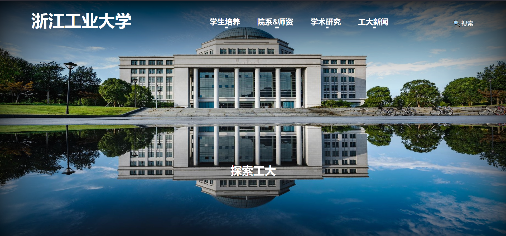
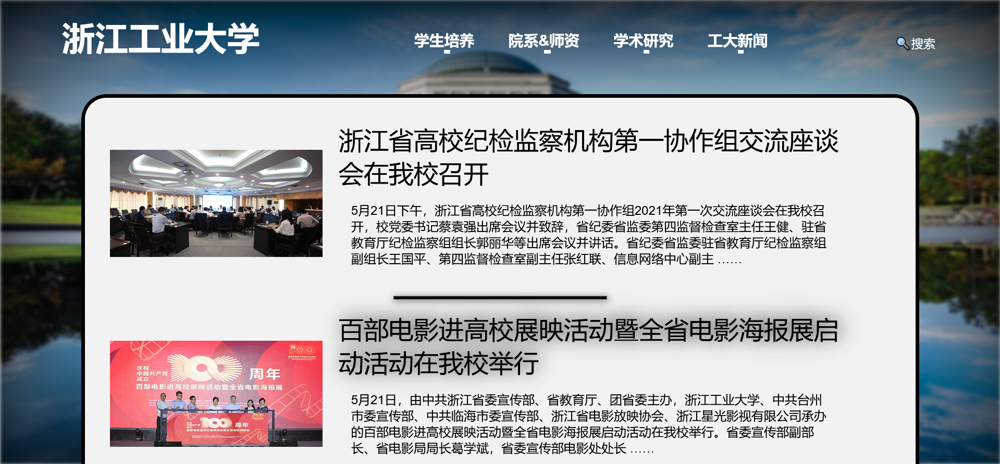

# ZJUT-SchoolSite
>重制的浙江工业大学网站🏫
>
>喜欢的话请给我Star吧！🌟

使用框架: [Vue.js](https://vuejs.org)

## 页面展示

1. [首页](src/index.html)

   

2.  [新闻列表页](src/newsSite.html)

   

   

3. [新闻页](src/newsTemplate.html)

#### 遗憾

- 未进行响应式设计
- 未更好的利用Vue等
- 没使用任何一个npm工具
- 没有任何一个点击事件
- 未使用Typescript
- 新闻模板页中Vue的选择生成类型太少

#### 收获

- 学习了CSS动画基本设计

- 学了Vue(但只学了一点点)

- 实现了自己的美学追求

#### 未来可能会加上

- [x] EsLint
- [ ] Responsive Design
- [ ] More Interaction